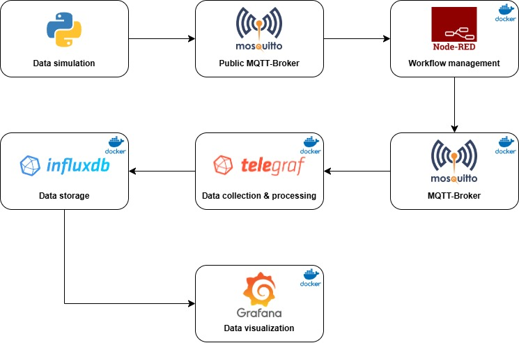

# Smart home - Project for Software Engineering for Autonomous Systems (A.Y. 24-25).

<p align="center">
  
</p>

### Members names and contacts:

<table>
  <tbody>
    <tr>
      <td><strong>Name</strong></td>
      <td><strong>Surname</strong></td>
      <td><strong>Matr.</strong></td>
      <td><strong>Contact</strong></td>
    </tr>
    <tr>
      <td>Dario</td>
      <td>D'Ercole</td>
      <td>288643</td>
      <td><a href="mailto:dario.dercole@student.univaq.it">dario.dercole@student.univaq.it</a></td>
    </tr>
    <tr>
      <td>Giovanni</td>
      <td>Spaziani</td>
      <td>295397</td>
      <td><a href="mailto:giovanni.spaziani@student.univaq.it">giovanni.spaziani@student.univaq.it</a></td>
    </tr>
  </tbody>
</table>

#### Built with: [![Python][Python.com]][Python-url] [![Docker][Docker.com]][Docker-url] [![InfluxDB][InfluxDB.com]][InfluxDB-url] [![NodeRED][NodeRED.com]][NodeRED-url] [![MQTT][MQTT.com]][MQTT-url] [![Grafana][Grafana.com]][Grafana-url] [![Telegraf][Telegraf.com]][Telegraf-url]

## Introduction
The Smart Home project is a case study that explores the software architecture for adaptable systems in smart home environments, using the MAPE-K paradigm. The goal of the system is to manage various smart devices and sensors, such as the thermostat, roller shutters and dish washer, optimizing energy consumption and improving home comfort. 

The MAPE-K architecture is based on five main components: Monitor, Analyze, Plan, Execute and Knowledge, which work together to monitor the state of the environment, analyze the collected data, plan corrective actions and implement strategies to optimize system performance. 

During the project, various smart devices will be introduced and managed, including temperature and energy consumption sensors, actuators such as smart roller shutters and dish washer, and a smart refrigerator that helps optimize energy efficiency thanks to new integrated sensors. This project represents a concrete example of how autonomous systems can dynamically adapt to environmental conditions to improve efficiency and user comfort. 

## Architecture diagram

<p align="center">
  
</p>

## Prerequisites

Before starting with the project setup, ensure the following prerequisites are met:

- Docker.
- Python.

# Smart home monitoring project - Data Flow

## 1. ![Python][Python.com]: Data Simulation
<ins>Description</ins>: The flow begins with Python simulating everything, including sensors, actuators, executors etc. All these scripts are dockerized.

<ins>Data generated</ins>: These devices generate data such as energy consumption, power, temperature, light and amount of food stored.

## 2. ![MQTT][MQTT.com]: Communication Between Components
<ins>Transport</ins>: MQTT, through a broker (e.g. Mosquitto, also dockerized), manages communication between the simulated devices and Node-RED.

<ins>Function</ins>: Enables efficient data exchange using a publish/subscribe topic system.

<ins>Efficiency</ins>: Lightweight and reliable, it's ideal for real-time data transfer in distributed environments.

## 3. ![NodeRED][NodeRED.com]: Workflow Management
<ins>Data Reception</ins>: The simulated data from Python is then sent to Node-RED.

<ins>Function</ins>: Node-RED (also dockerized) manages and orchestrates the flow of this data.

<ins>Processing</ins>: It processes and formats the data, preparing it for collection and strage.

## 4. ![Telegraf][Telegraf.com]: Data Collection and Processing
<ins>Collection</ins>: Telegraf, running in its own Docker's container, collects the processed data from Node-RED.

<ins>Role</ins>: It acts as an agent that further processes and aggregates the data.

<ins>Efficiency</ins>: Telegraf ensures efficient data handling before storage.

## 5. ![InfluxDB][InfluxDB.com]: Data Storage
<ins>Storage</ins>: The aggregated data is then stored in InfluxDB.

<ins>Infrastructure</ins>: InfluxDB, dockerized for consistency and scalability, stores this time-series data.

<ins>Retrieval</ins>: It facilitates efficient data retrieval for analysis and visualization.

## 6. ![Grafana][Grafana.com]: Data Visualization
<ins>Visualization</ins>: Finally, the data stored in InfluxDB is visualized using Grafana.

<ins>Dashboard Creation</ins>: Grafana (also dockerized) creates interactive dashboards.

<ins>Display</ins>: These dashboards display real-time data on current, power, voltage, frequency, and energy consumption.

---

<ins>**Note**: each component runs in a separate Docker container, which provides isolation, scalability, and easy deployment. The dockerization of each component also simplifies version control, dependency management, and environment consistency across different platforms.</ins>

## Usage

1. Ensure Python and Docker are installed on your machine. Visit:
   - [Python's official website](https://www.python.org/) for installation instructions.
   - [Docker's official website](https://www.docker.com/get-started) for installation instructions.

2. Clone this repository:
   ```sh
   git clone https://github.com/giovannispaziani/ProjectForSE4AS.git
   ```
3. Run the containers:
   ```sh
   docker-compose up
   ```

## Acknowledgments
* [Dario](https://github.com/Lindbrum)
* [Giovanni](https://github.com/giovannispaziani)

<!-- MARKDOWN LINKS & IMAGES -->
[Python.com]: https://img.shields.io/badge/Python-3776AB?style=for-the-badge&logo=python&logoColor=white  
[Python-url]: https://www.python.org/
[Docker.com]: https://img.shields.io/badge/docker-%230db7ed.svg?style=for-the-badge&logo=docker&logoColor=white
[Docker-url]: https://www.docker.com/
[InfluxDB.com]: https://img.shields.io/badge/InfluxDB-22ADF6?style=for-the-badge&logo=InfluxDB&logoColor=white
[InfluxDB-url]: https://www.influxdata.com/
[NodeRED.com]: https://img.shields.io/badge/Node--RED-%23ba141a.svg?style=for-the-badge&logo=nodered&logoColor=white  
[NodeRED-url]: https://nodered.org/
[MQTT.com]: https://img.shields.io/badge/MQTT-660066?style=for-the-badge&logo=mqtt&logoColor=white
[MQTT-url]: https://mqtt.org/
[Grafana.com]: https://img.shields.io/badge/Grafana-F46800?style=for-the-badge&logo=grafana&logoColor=white
[Grafana-url]: https://grafana.com/
[Telegraf.com]: https://img.shields.io/badge/Telegraf-000000?style=for-the-badge&logo=influxdata&logoColor=white  
[Telegraf-url]: https://www.influxdata.com/time-series-platform/telegraf/
