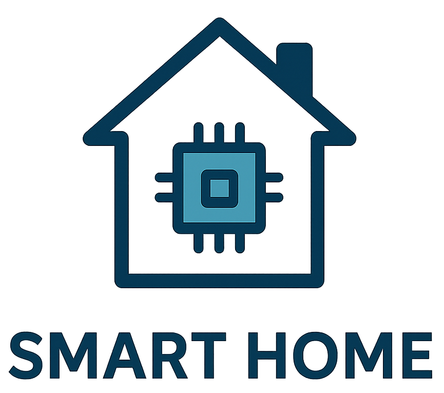

# Smart home - Project for Software Engineering for Autonomous Systems (A.Y. 24-25).

  

### Members names and contacts:
1) Dario D'Ercole - (288643) - dario.dercole@student.univaq.it
2) Giovanni Spaziani - (295397) - giovanni.spaziani@student.univaq.it

#### Built with: [![Python][Python.com]][Python-url] [![Docker][Docker.com]][Docker-url] [![InfluxDB][InfluxDB.com]][InfluxDB-url] [![NodeRED][NodeRED.com]][NodeRED-url] [![MQTT][MQTT.com]][MQTT-url] [![Grafana][Grafana.com]][Grafana-url] [![Telegraf][Telegraf.com]][Telegraf-url]

## Introduction
The Smart Home project is a case study that explores the software architecture for adaptable systems in smart home environments, using the MAPE-K paradigm. The goal of the system is to manage various smart devices and sensors, such as the thermostat, roller shutters and dish washer, optimizing energy consumption and improving home comfort. 

The MAPE-K architecture is based on five main components: Monitor, Analyze, Plan, Execute and Knowledge, which work together to monitor the state of the environment, analyze the collected data, plan corrective actions and implement strategies to optimize system performance. 

During the project, various smart devices will be introduced and managed, including temperature and energy consumption sensors, actuators such as smart roller shutters and dish washer, and a smart refrigerator that helps optimize energy efficiency thanks to new integrated sensors. This project represents a concrete example of how autonomous systems can dynamically adapt to environmental conditions to improve efficiency and user comfort. 

<!-- MARKDOWN LINKS & IMAGES -->
[Python.com]: https://img.shields.io/badge/Python-3776AB?style=for-the-badge&logo=python&logoColor=white  
[Python-url]: https://www.python.org/
[Docker.com]: https://img.shields.io/badge/docker-%230db7ed.svg?style=for-the-badge&logo=docker&logoColor=white
[Docker-url]: https://www.docker.com/
[InfluxDB.com]: https://img.shields.io/badge/InfluxDB-22ADF6?style=for-the-badge&logo=InfluxDB&logoColor=white
[InfluxDB-url]: https://www.influxdata.com/
[NodeRED.com]: https://img.shields.io/badge/Node--RED-%23ba141a.svg?style=for-the-badge&logo=nodered&logoColor=white  
[NodeRED-url]: https://nodered.org/
[MQTT.com]: https://img.shields.io/badge/MQTT-660066?style=for-the-badge&logo=mqtt&logoColor=white
[MQTT-url]: https://mqtt.org/
[Grafana.com]: https://img.shields.io/badge/Grafana-F46800?style=for-the-badge&logo=grafana&logoColor=white
[Grafana-url]: https://grafana.com/
[Telegraf.com]: https://img.shields.io/badge/Telegraf-000000?style=for-the-badge&logo=influxdata&logoColor=white  
[Telegraf-url]: https://www.influxdata.com/time-series-platform/telegraf/
